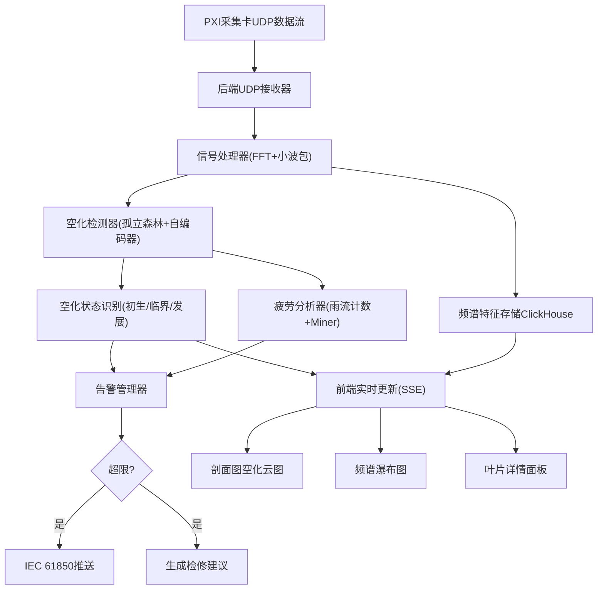

## 1. 产品概述

大型水电站水轮机空化噪声监测与寿命评估系统，用于6台混流式水轮机的实时空化状态识别、叶片疲劳寿命评估和智能告警。系统通过PXI采集卡接收20个传感器（12水听器+8加速度计）的高速数据流，基于频谱特征与小波包能量进行深度异常检测，用雨流计数法和Miner累积损伤理论计算叶片剩余寿命。

- 目标用户：水电站运维工程师、设备管理人员
- 核心价值：实现空化初生早期预警，避免叶片严重空蚀损坏，延长机组检修周期

## 2. 核心功能

### 2.1 功能模块

1. **监测总览页**：6台机组状态卡片、全局告警摘要、系统运行指标
2. **机组详情页**：水轮机剖面图（Canvas+WebGL）、空化云图叠加、频谱瀑布图、叶片详情面板
3. **告警管理页**：告警列表、IEC 61850推送状态、检修建议

### 2.2 页面详情

| 页面名称 | 模块名称 | 功能描述 |
|----------|----------|----------|
| 监测总览 | 机组状态卡片 | 6台机组运行状态、空化阶段色标、关键指标 |
| 监测总览 | 全局告警摘要 | 最近告警滚动列表、告警级别统计 |
| 机组详情 | 水轮机剖面图 | Canvas+WebGL绘制混流式水轮机剖面，蜗壳/导叶/转轮/尾水管各部位 |
| 机组详情 | 空化云图叠加 | 空化强度用颜色梯度叠加在转轮叶片上，不同空化阶段用不同颜色标注 |
| 机组详情 | 频谱瀑布图 | 噪声频谱三维瀑布图实时滚动，显示频域随时间变化 |
| 机组详情 | 叶片详情面板 | 点击叶片弹出，显示该区域空化历史趋势曲线和累计空蚀损伤 |
| 机组详情 | 实时指标面板 | 当前传感器读数、振动速度、空化强度数值 |
| 告警管理 | 告警列表 | 按时间/级别筛选告警记录 |
| 告警管理 | 检修建议 | 基于告警生成的检修建议详情 |
| 告警管理 | IEC 61850状态 | 显示已推送至监控系统的告警记录 |

## 3. 核心流程

## 4. 用户界面设计

### 4.1 设计风格

- 主色调：深蓝灰工业风（#0B1426 背景，#1E3A5F 次级，#00D4FF 强调色）
- 辅助色：空化阶段色谱 — 无(#2ECC71)、初生(#F39C12)、临界(#E74C3C)、发展(#8E44AD)
- 按钮风格：扁平化圆角，微光效果边框
- 字体：JetBrains Mono（数据）+ Noto Sans SC（中文）
- 布局：左侧导航+主内容区，深色主题，高对比度数据可视化

### 4.2 页面设计概述

| 页面名称 | 模块名称 | UI元素 |
|----------|----------|--------|
| 监测总览 | 机组卡片 | 深色卡片、空化色标环、数值指标、脉动动画 |
| 机组详情 | 剖面图 | Canvas全屏绘制、WebGL粒子/云图、点击交互 |
| 机组详情 | 瀑布图 | WebGL三维频谱、渐变色彩、自动滚动 |
| 机组详情 | 详情面板 | 右侧抽屉、趋势折线图、损伤进度条 |

### 4.3 响应式

桌面优先，1920×1080为主分辨率，1280px以上完整布局，1280px以下侧边栏折叠

### 4.4 动效

- 空化云图脉动效果（CSS animation + Canvas重绘）
- 瀑布图实时滚动
- 告警闪烁动画
- 数值变化过渡动画
