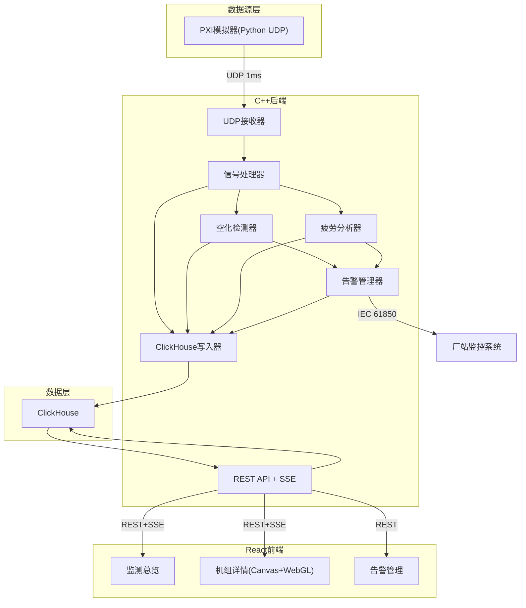

## 1. 架构设计



## 2. 技术说明

- 前端：React@18 + TypeScript + Vite + Tailwind CSS
- 可视化：Canvas 2D + WebGL（频谱瀑布图、空化云图）
- 后端：C++17（已实现），REST API + SSE
- 数据库：ClickHouse（已建表）
- 通信：UDP（PXI数据采集）→ C++后端 → REST/SSE → React前端

## 3. 路由定义

| 路由 | 用途 |
|------|------|
| / | 监测总览页 - 6台机组状态卡片+全局告警 |
| /turbine/:id | 机组详情页 - 剖面图+空化云图+瀑布图+叶片面板 |
| /alarms | 告警管理页 - 告警列表+检修建议+IEC状态 |

## 4. API定义

### 4.1 REST接口

| 方法 | 路径 | 说明 | 响应类型 |
|------|------|------|----------|
| GET | /api/turbines | 机组列表 | `{turbines: [{id, name, status, cavitation_summary}]}` |
| GET | /api/turbines/:id/status | 机组当前空化状态 | `{blade_statuses: [{blade_id, zone_id, stage, intensity}]}` |
| GET | /api/turbines/:id/blades/:bid/history | 叶片空化历史 | `{history: [{timestamp, stage, intensity}]}` |
| GET | /api/turbines/:id/blades/:bid/fatigue | 叶片疲劳信息 | `{fatigue: [{cumulative_damage, remaining_life}]}` |
| GET | /api/turbines/:id/spectrum?sensor_id=X | 最新频谱 | `{fft_magnitude, dominant_freq, band_powers}` |
| GET | /api/turbines/:id/waterfall?sensor_id=X&duration=60 | 瀑布图数据 | `{time_slices: [{timestamp, spectrum}]}` |
| GET | /api/alarms?severity=X | 告警列表 | `{alarms: [{timestamp, type, severity, ...}]}` |
| GET | /api/config | 系统配置 | `{thresholds, sample_rate, ...}` |

### 4.2 SSE接口

| 路径 | 说明 | 事件类型 |
|------|------|----------|
| /api/turbines/:id/realtime | 实时空化数据推送 | `cavitation_update`, `alarm`, `spectrum_update` |

## 5. 前端组件架构

```
src/
├── pages/
│   ├── Dashboard.tsx          # 监测总览
│   ├── TurbineDetail.tsx      # 机组详情
│   └── Alarms.tsx             # 告警管理
├── components/
│   ├── layout/
│   │   ├── Sidebar.tsx        # 侧边导航
│   │   └── Header.tsx         # 顶部栏
│   ├── dashboard/
│   │   ├── TurbineCard.tsx    # 机组状态卡片
│   │   └── AlarmSummary.tsx   # 告警摘要
│   ├── turbine/
│   │   ├── TurbineProfile.tsx # 水轮机剖面图(Canvas+WebGL)
│   │   ├── CavitationCloud.tsx# 空化云图渲染器
│   │   ├── WaterfallSpectrum.tsx # 频谱瀑布图(WebGL)
│   │   ├── BladePanel.tsx     # 叶片详情面板
│   │   └── RealtimeMetrics.tsx# 实时指标
│   └── alarms/
│       ├── AlarmList.tsx      # 告警列表
│       └── MaintenanceAdvice.tsx # 检修建议
├── hooks/
│   ├── useSSE.ts              # SSE连接Hook
│   ├── useTurbineData.ts      # 机组数据Hook
│   └── useAlarms.ts           # 告警数据Hook
├── stores/
│   └── monitorStore.ts        # Zustand全局状态
├── utils/
│   ├── canvasRenderer.ts      # Canvas绘图工具
│   ├── webglRenderer.ts       # WebGL渲染工具
│   └── colorScales.ts         # 空化色谱定义
└── types/
    └── index.ts               # TypeScript类型定义
```

## 6. 数据模型

ClickHouse表结构已在 sql/init_clickhouse.sql 中定义：
- raw_signal: 原始信号数据（30天TTL）
- spectrum_feature: 频谱特征（90天TTL）
- cavitation_status: 空化状态（365天TTL）
- fatigue_damage: 疲劳损伤（365天TTL）
- alarm_record: 告警记录（180天TTL）
- turbine_config: 机组配置
- sensor_config: 传感器配置
